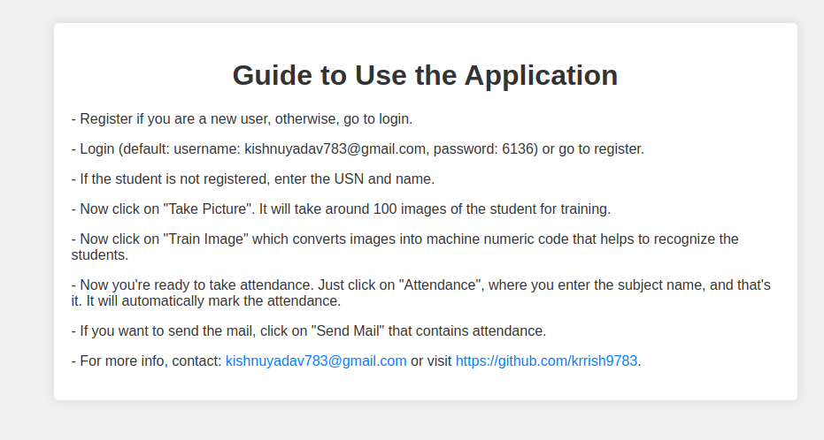

# EZY Attendance v2.0


## Description

EZY Attendance is a sophisticated face recognition-based attendance system with a user-friendly GUI. It allows users to efficiently manage attendance, export data in CSV format, and even send attendance reports via email. Built using Python 3, SQL, Tkinter, and various libraries, EZY Attendance simplifies attendance tracking for organizations of all sizes.

##Devs


##Guide 


## Features

- Face recognition-based attendance tracking
- Intuitive GUI for easy navigation
- Export attendance data to CSV format
- Send attendance reports via email
- Customize settings for different organizational needs

## Installation

1. Clone the repository:
   ```bash
   git clone https://github.com/krrish9783/EZY-Attendance.git

Navigate to the project directory:


cd EZY-Attendance

Install dependencies:


pip install -r requirements.txt

Usage

Ensure your webcam is connected and functional.
Run the application:

python3 main.py

Follow the on-screen instructions to take attendance, export data, or send reports.

Contributing
Contributions are welcome! If you'd like to contribute to EZY Attendance, please follow these steps:

Fork the repository
Create a new branch (git checkout -b feature/contribution)
Make your changes
Commit your changes (git commit -am 'Add new feature')
Push to the branch (git push origin feature/contribution)
Create a new Pull Request
License
This project is licensed under the MIT License.
